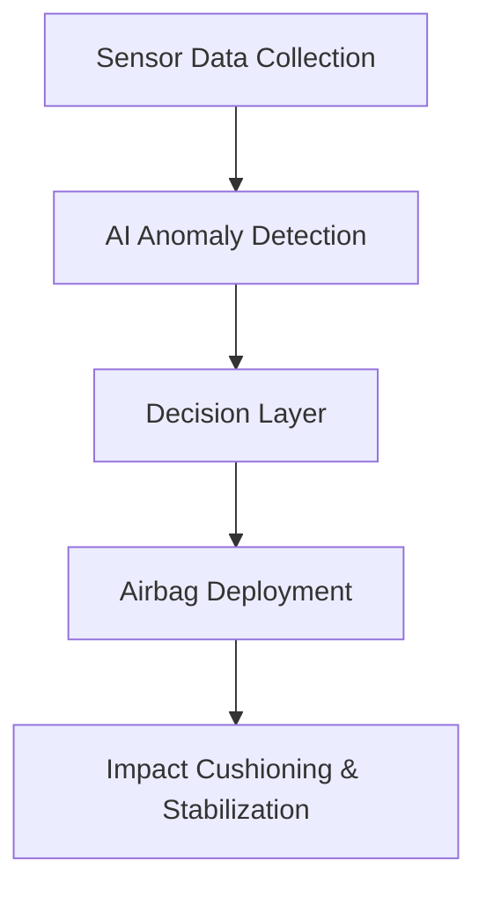

# SafeGlide – Adaptive Airbag System for Safer Aircraft Landings

---

## About the Project

SafeGlide is an **AI-powered adaptive airbag system** designed to make emergency aircraft landings survivable.

While 70% of survivable aviation accidents involve hard landings or runway overruns, existing systems focus on preventing crashes — not minimizing impact when they do occur.

SafeGlide bridges this gap by deploying an under-fuselage airbag raft in **under 150 milliseconds**, reducing peak G-forces by up to 50% and stabilizing the aircraft to prevent rollovers and secondary crashes.

Developed for the **International Innovation Hackathon 2.0 (Space & Aerotech Innovation Track)**.

---

## How It Works

SafeGlide uses a three-step adaptive safety mechanism powered by real-time sensor fusion and predictive AI models:

1. **Sense** – Monitors descent speed, angle, altitude, and gear behavior using radar altimeters & IMUs.
2. **Decide** – AI anomaly detection identifies unsafe landing scenarios within milliseconds.
3. **Act** – High-pressure inflators deploy the adaptive airbag raft in under 150 ms.

### Tech Flow

---

## Key Innovations

* AI-powered predictive safety system.
* Ultra-fast airbag deployment (<150 ms).
* Reduction of peak G-forces by \~50%.
* Aircraft stabilization to prevent rollovers and secondary crashes.
* Scalable design for both small aircraft and large commercial airliners.

---

## Tech Implementation

* **Hardware**: Radar altimeters, IMUs, pressure sensors, high-speed inflators.
* **Software**: Real-time AI anomaly detection, embedded controller for decision logic, 3D visualization using React + Three.js (R3F).

---

## Feasibility & Impact

* Leverages existing aviation components for easier integration.
* Reduces peak G-forces by \~50%, increasing survival rates.
* Applicable to private jets, commercial aircraft, and cargo planes.
* Improves global aviation safety standards and passenger confidence.

---

## Demo Snapshots

*(Insert screenshots or 3D renders from your simulation here)*

---

## Team GrowthX – Collaborators

Developed at the **International Innovation Hackathon 2.0** by:

* Arkadeep Nag([@arkadeepnag])(https://github.com/arkadeepnag)
* Vansh Malik([@thevanshmalik])(https://github.com/thevanshmalik)
* Srushti Dungrani([@srushtidungrani06])(https://github.com/srushtidungrani06)
* Aryan Pathak([@aryanpathak376])(https://github.com/aryanpathak376)

---

## License

This project is licensed under the **MIT License**.

---

## Future Roadmap

* Hardware prototype testing with scaled aircraft models.
* Integration with aircraft avionics systems.
* Field tests under simulated crash-landing conditions.
* Enhanced AI prediction with larger datasets.
